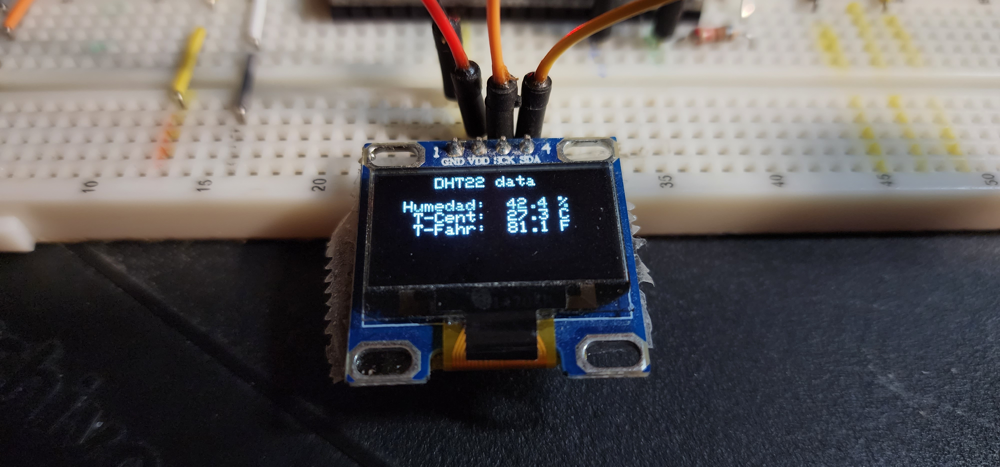

#   Project 09-oled-dht

   Electronica Digital - Austral 2023 - EAM
    
##  Show DHT measurements in OLED display SSD1306 in text mode

   Using ESP32 development board

### Hardware

   1 Temperature and humidity sensor: DHT11 or DHT22
   1 10K resistor
   1 OLED display 0.96"
   Jumper wires

###  Connections

####    DHT connections

   Connect Pin 1 of DHT-XX to 3.3 V  
   Connect Pin 2 of DHT-XX to GPIO "DHTPIN"  
   Leave Pin 3 of DHT-XX unconnected  
   Connect Pin 4 of DHT-XX to GND  

   Connect Pin 2 of DHT-XX to one side 10 K resistor  
   Connect other side of 10 K resistor to 3.3V  

####    OLED display connections

   Connect OLED GND to GND  
   Connect OLED VCC to 3.3V  
   Connect OLED SCL to GPIO22  
   Connect OLED SDA to GPIO21  

   **Nota importante**: si bien todos los OLED 0.96" tienen 4 conexiones, la ubicación de los respectivos contactos no están en el mismo orden en todas las fabricaciones

###     Coding

   Uses libraries for DHT sensor (same as project 07-dht)
   Uses libraries for OLED display (same as in project 09-oled-test)

   As you see in testing of OLED display in project 09-oled-test, using the library for text only is cumbersome; in order to easing this usage, a _wrapper_ is constucted around the base library.
   For using this _wrapper_, you must add to the project the files _oled_ruts.cpp_ and _oled_ruts.h_; in the file using the _wrapper_ calls, the header file _oled_ruts.h_ must be included.
   Use this project as an example of usage of _wrapper_ calls.

   Basically, in _setup_ a call to _oled_init_ must be made; then, for showing information in the display, following sequence must be used:

   Call to _oled_open_, passing as argument the font size to use
       Argument _size_text_ selecting one of the _enum size_text_
   For each line in display, call to _oled_line_:
       Argument _align_: taken from one of the _enum align_
       Argument _line_: from 0 to _max-1_ where _max_ depends on _enum size_text_:
           LITTLE_TEXT = 8, MEDIUM_TEXT = 4, LARGE_TEXT = 2
       Argument _text_: name of array of chars where is text to be displayed
   Call to _oled_close_ with no arguments to show in display

###  Verification

   Prints in OLED display same information as in project _07-dht_ 

###  Photos

 

###  Links

  Una explicación resumida pero buena, introductoria al SSD1306 display OLED 0.96"

  [ESP32 OLED Display with Arduino IDE](https://randomnerdtutorials.com/esp32-ssd1306-oled-display-arduino-ide/)

  Si bien está escrito para el ESP8266, es una muy buena explicación de los OLED pequeños

  [SSD1306 pantalla OLED con Arduino y ESP8266 I2C](https://programarfacil.com/blog/arduino-blog/ssd1306-pantalla-oled-con-arduino/)

### Videos

  Si bien un poco extenso (mas de 40 minutos) la explicación es muy detallada

  [OLED Displays with Arduino - I2C & SPI OLEDs](https://www.youtube.com/watch?v=7x1P80X1V3E)

